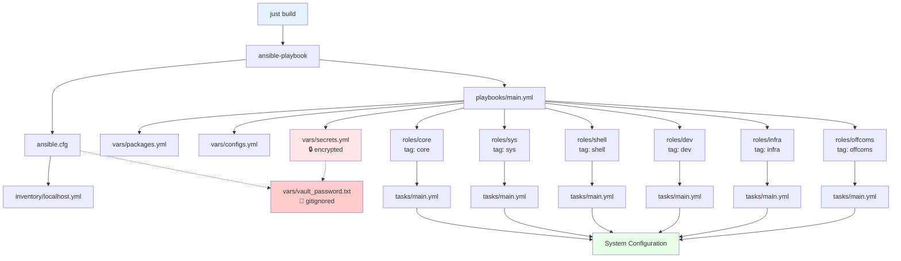

# donkey-kong
ansible for my work laptop

## Step-by-Step Initial Deployment

### 1. Bootstrap System (Ubuntu 24.04)

Run the bootstrap script to install required tools and clone the repository:

```bash
curl -sSL https://raw.githubusercontent.com/bashfulrobot/donkey-kong/main/bootstrap/bootstrap.sh | bash
cd ~/dev/kong/hardware/donkey-kong
```

Or download and inspect first:
```bash
wget https://raw.githubusercontent.com/bashfulrobot/donkey-kong/main/bootstrap/bootstrap.sh
chmod +x bootstrap.sh
./bootstrap.sh
cd ~/dev/kong/hardware/donkey-kong
```

### 2. Configure Secrets (First Time Only)

Set up your vault password and secrets:

```bash
# Get setup instructions
just setup-vault

# 1. Edit your vault password
hx vars/vault_password.txt

# 2. Edit your secrets with real values
hx vars/secrets.yml

# 3. Encrypt the secrets file
just encrypt-secrets

# 4. Verify security
just check-vault
```

### 3. Run Configuration

Choose your deployment approach:

```bash
# Full laptop configuration
just build

# Specific components only
just dev        # Development tools
just infra      # Infrastructure tools
just offcoms    # Office/communications
just shell      # Shell configuration
just sys        # System configuration
just core       # Core system setup

# Skip components
just build-skip-offcoms
just build-skip-infra

# Test first (dry run)
just check
just check-dev
```

### 4. Verify Installation

```bash
# Test ansible connectivity
just ping

# Check configuration syntax
just syntax

# Verify vault security
just check-vault
```

## Ansible Code Flow

The following diagram shows how the Ansible configuration flows from execution to roles:



**Flow Explanation:**
1. **justfile** commands trigger ansible-playbook
2. **ansible.cfg** provides configuration and vault password path
3. **inventory** defines localhost target
4. **main.yml** orchestrates the execution with tags
5. **vars/** files provide configuration data (secrets encrypted)
6. **roles/** execute based on selected tags
7. Each role's **tasks/main.yml** performs actual system configuration

**Security Layer:** Vault password file is gitignored and secrets are encrypted before any git operations.

## Available Commands

| Command | Description |
|---------|-------------|
| `just build` | Full laptop configuration |
| `just dev` | Install development tools |
| `just infra` | Install infrastructure tools |
| `just offcoms` | Install office/communications apps |
| `just shell` | Configure shell environment |
| `just sys` | System configuration |
| `just core` | Core system setup |
| `just check` | Dry run (preview changes) |
| `just ping` | Test ansible connectivity |
| `just syntax` | Check playbook syntax |

## Vault Management

| Command | Description |
|---------|-------------|
| `just edit-secrets` | Edit encrypted secrets |
| `just view-secrets` | View encrypted secrets |
| `just encrypt-secrets` | Encrypt secrets file |
| `just decrypt-secrets` | Decrypt secrets file |
| `just check-vault` | Verify vault security |
| `just setup-vault` | First-time vault setup |

## Security Features

- **Git Pre-commit Hook**: Automatically prevents committing unencrypted secrets
- **Vault Password Protection**: Password file is gitignored and never committed
- **Secret Scanning**: Warns about potential secrets in other files
- **Encryption Verification**: Multiple validation layers ensure secrets stay encrypted

## Project Structure

```
├── justfile                # Task runner commands
├── ansible.cfg            # Ansible configuration
├── bootstrap/             # Initial system setup
├── inventory/             # Ansible inventory
├── playbooks/             # Main playbooks
├── roles/                 # Ansible roles by tag
│   ├── core/             # Essential system (core tag)
│   ├── sys/              # System config (sys tag)
│   ├── shell/            # Shell setup (shell tag)
│   ├── dev/              # Dev tools (dev tag)
│   ├── infra/            # Infrastructure (infra tag)
│   └── offcoms/          # Office/comms (offcoms tag)
├── vars/                 # Variables and secrets
└── files/                # Static files and dotfiles
```
