# donkey-kong
ansible for my work laptop

## Step-by-Step Initial Deployment

### 1. Bootstrap System (Ubuntu 24.04)

Run the bootstrap script to install required tools and clone the repository:

```bash
wget -qO- https://raw.githubusercontent.com/bashfulrobot/donkey-kong/main/bootstrap/bootstrap.sh | bash
cd ~/dev/kong/hardware/donkey-kong
```

Or download and inspect first:
```bash
wget https://raw.githubusercontent.com/bashfulrobot/donkey-kong/main/bootstrap/bootstrap.sh
chmod +x bootstrap.sh
./bootstrap.sh
cd ~/dev/kong/hardware/donkey-kong
```

### 2. Configure Secrets (First Time Only)

Set up your vault password and secrets:

```bash
# Get setup instructions
just setup-vault

# 1. Edit your vault password
hx vars/vault_password.txt

# 2. Edit your secrets with real values
hx vars/secrets.yml

# 3. Encrypt the secrets file
just encrypt-secrets

# 4. Verify security
just check-vault
```

### 3. Run Configuration

Choose your deployment approach:

```bash
# Full laptop configuration
just build

# Specific components only
just dev        # Development tools
just infra      # Infrastructure tools
just offcoms    # Office/communications
just shell      # Shell configuration
just sys        # System configuration
just core       # Core system setup

# Skip components
just build-skip-offcoms
just build-skip-infra

# Test first (dry run)
just check
just check-dev
```

### 4. Verify Installation

```bash
# Test ansible connectivity
just ping

# Check configuration syntax
just syntax

# Verify vault security
just check-vault
```

## Ansible Code Flow

The following diagram shows how the Ansible configuration flows from execution to roles:

```mermaid
flowchart TD
    A[just build] --> B[ansible-playbook]
    B --> C[ansible.cfg]
    C --> D[inventory/localhost.yml]
    B --> E[playbooks/main.yml]
    
    E --> F[vars/packages.yml]
    E --> G[vars/configs.yml] 
    E --> H[vars/secrets.yml<br/>🔒 encrypted]
    
    E --> I[roles/core<br/>tag: core]
    E --> J[roles/sys<br/>tag: sys]
    E --> K[roles/shell<br/>tag: shell]
    E --> L[roles/dev<br/>tag: dev]
    E --> M[roles/infra<br/>tag: infra]
    E --> N[roles/offcoms<br/>tag: offcoms]
    
    I --> I1[tasks/main.yml<br/>📋 Suite Orchestrator]
    J --> J1[tasks/main.yml<br/>📋 Suite Orchestrator]
    K --> K1[tasks/main.yml<br/>📋 Suite Orchestrator]
    L --> L1[tasks/main.yml<br/>📋 Suite Orchestrator]
    M --> M1[tasks/main.yml<br/>📋 Suite Orchestrator]
    N --> N1[tasks/main.yml<br/>📋 Suite Orchestrator]
    
    I1 --> I2[general.yml<br/>git.yml<br/>ssh.yml]
    J1 --> J2[general.yml<br/>network.yml<br/>security.yml<br/>performance.yml]
    K1 --> K2[general.yml<br/>zsh.yml<br/>tmux.yml<br/>aliases.yml]
    L1 --> L2[general.yml<br/>nodejs.yml<br/>python.yml<br/>golang.yml<br/>docker.yml]
    M1 --> M2[general.yml<br/>kubernetes.yml<br/>terraform.yml<br/>cloud-tools.yml]
    N1 --> N2[general.yml<br/>browsers.yml<br/>communications.yml<br/>office.yml]
    
    I2 --> O[System Configuration]
    J2 --> O
    K2 --> O
    L2 --> O
    M2 --> O
    N2 --> O
    
    C -.-> P[vars/vault_password.txt<br/>🚫 gitignored]
    H -.-> P
    
    style H fill:#ffe6e6
    style P fill:#ffcccc
    style A fill:#e6f3ff
    style O fill:#e6ffe6
    style I1 fill:#fff2e6
    style J1 fill:#fff2e6
    style K1 fill:#fff2e6
    style L1 fill:#fff2e6
    style M1 fill:#fff2e6
    style N1 fill:#fff2e6
```



**Flow Explanation:**
1. **justfile** commands trigger ansible-playbook
2. **ansible.cfg** provides configuration and vault password path
3. **inventory** defines localhost target
4. **main.yml** orchestrates the execution with tags
5. **vars/** files provide configuration data (secrets encrypted)
6. **roles/** execute based on selected tags
7. Each role's **main.yml** acts as a suite orchestrator
8. **Suite files** handle specific app configurations (e.g., nodejs.yml, docker.yml)
9. **general.yml** in each suite handles simple package installations

**Suite Structure:** Each role now uses a modular approach where `main.yml` orchestrates multiple specialized task files, allowing for both simple bulk installations (`general.yml`) and complex app-specific configurations (individual `.yml` files).

**Security Layer:** Vault password file is gitignored and secrets are encrypted before any git operations.

## Available Commands

### Installation Commands
| Command | Description |
|---------|-------------|
| `just build` | Full laptop configuration |
| `just dev` | Install development tools |
| `just infra` | Install infrastructure tools |
| `just offcoms` | Install office/communications apps |
| `just shell` | Configure shell environment |
| `just sys` | System configuration |
| `just core` | Core system setup |
| `just check` | Dry run (preview changes) |
| `just ping` | Test ansible connectivity |
| `just syntax` | Check playbook syntax |

### Removal Commands
| Command | Description |
|---------|-------------|
| `just remove` | Remove ALL installed packages and configurations |
| `just remove-dev` | Remove development tools only |
| `just remove-shell` | Remove shell tools and configurations |
| `just remove-core` | Remove core packages and configurations |
| `just remove-sys` | Remove system packages |
| `just remove-infra` | Remove infrastructure tools |
| `just remove-offcoms` | Remove office/communications apps |

**⚠️ Warning:** Removal commands will uninstall packages and may remove configurations. Use with caution, especially `just remove` which removes everything.

## Package/Configuration Removal

The removal system uses Ansible's state-based approach to reverse installations:

### Examples
```bash
# Remove all development tools
just remove-dev

# Remove shell customizations and tools  
just remove-shell

# Remove everything (nuclear option)
just remove

# Test what would be removed (dry run)
just check -e "package_state=absent"
```

### How Package Groups Work
Package removal uses an **"all or nothing"** approach - removing a component uninstalls ALL packages in that group. This keeps the system simple and predictable.

### What Gets Removed
- **Packages**: ALL packages in the selected group are uninstalled
- **Services**: Stopped and disabled  
- **Global npm packages**: Uninstalled (when removing dev tools)
- **Some configs**: Removed when config_state=absent

### What Doesn't Get Removed
- User data and home directory files
- Manual configurations you've made
- Dependencies installed by other packages
- System packages that other software depends on
- Package configuration files (may need manual cleanup)
- Cache files and logs created by removed packages

### Selective Package Removal Workflow
To remove individual packages from a group while keeping others:

1. **Remove the entire group**: `just remove-shell`
2. **Edit the package list**: Remove unwanted packages from the appropriate file:
   - Core packages: `vars/packages.yml` 
   - Additional tools: `roles/*/tasks/general.yml`
3. **Reinstall the group**: `just shell`

**Example - Remove `bat` from shell tools:**
```bash
# 1. Remove all shell tools
just remove-shell

# 2. Edit roles/shell/tasks/general.yml and remove 'bat' from the list
hx roles/shell/tasks/general.yml

# 3. Reinstall shell tools (now without bat)
just shell
```

This keeps the configuration simple while allowing selective removal when needed.

### Manual Cleanup
After removing packages, you may want to manually clean up leftover files:

```bash
# Remove package configuration files
sudo apt autoremove --purge

# Clean package cache
sudo apt autoclean

# Remove leftover config directories (be careful!)
# Example locations: ~/.config/app-name, ~/.cache/app-name, ~/.local/share/app-name

# Check for orphaned packages
sudo deborphan

# Remove npm cache (if removing Node.js tools)
npm cache clean --force
```

**⚠️ Warning:** Always verify what files you're removing before deleting configuration directories.

## Vault Management

| Command | Description |
|---------|-------------|
| `just edit-secrets` | Edit encrypted secrets |
| `just view-secrets` | View encrypted secrets |
| `just encrypt-secrets` | Encrypt secrets file |
| `just decrypt-secrets` | Decrypt secrets file |
| `just check-vault` | Verify vault security |
| `just setup-vault` | First-time vault setup |

## Security Features

- **Git Pre-commit Hook**: Automatically prevents committing unencrypted secrets
- **Vault Password Protection**: Password file is gitignored and never committed
- **Secret Scanning**: Warns about potential secrets in other files
- **Encryption Verification**: Multiple validation layers ensure secrets stay encrypted

## Project Structure

```
├── justfile                # Task runner commands
├── ansible.cfg            # Ansible configuration
├── bootstrap/             # Initial system setup
├── inventory/             # Ansible inventory
├── playbooks/             # Main playbooks
├── roles/                 # Ansible roles by tag
│   ├── core/             # Essential system (core tag)
│   ├── sys/              # System config (sys tag)
│   ├── shell/            # Shell setup (shell tag)
│   ├── dev/              # Dev tools (dev tag)
│   ├── infra/            # Infrastructure (infra tag)
│   └── offcoms/          # Office/comms (offcoms tag)
├── vars/                 # Variables and secrets
└── files/                # Static files and dotfiles
```
